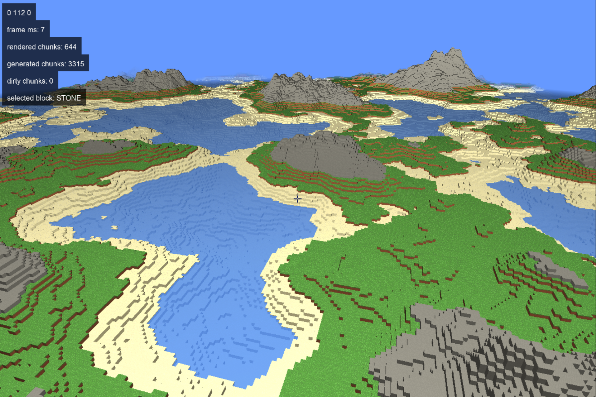

## keybinds
* wasd, space, ctrl, shift: move
* esc: quit
* b: capture mouse	
* e: render mode line
* c: 2d camera
* f: player physics
* tab: debug text visible
* mousewheel: change selected block

## dependencies
* SDL3, 
* sonst alles mit drin

## clone with submodules: git clone --recursive <url>

## TODO
* physik: better collision, jump
* ui cleanup

* resizable window

* transparent blocks
* render water when only above neighbor not water

* noise besser
* better light ?
  
* texture array -> mipmap, multisample
  
* threads für chunkgen
